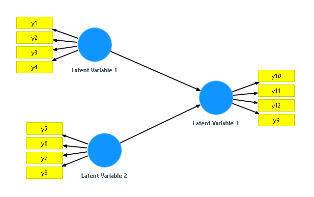

```{r, echo=FALSE,warning=FALSE}
#Initialization

#Clear Environment
rm(list=ls())

#Load our Libraries
source("./lib/simplePLS.R")
source("./lib/graphUtils.R")

#Load Specific Code
source("./Meeting 8.R")

#Load Library for PCA
library(psych)

#Load Original Data
Anime=read.csv("./data/originalData.csv",header=T)

#Create Index to Randomize Data
set.seed(123)
index=sample.int(dim(Anime)[1],183,replace=F)

#Prepare variables for Cross-Validation Results
plsPredictTest <- NULL
plsResidualsTest <- NULL
lmPredictTest <- NULL
lmResidualsTest <- NULL
crossTrainData <-NULL
crossTestData <-NULL

#Run a cicle to take 10 subsamples of 10 observations each and run the models
for (i in seq(10,100, by =10)){
  
  #Get subsamples
  trainData <- Anime[-index[(i-9):i],]
  testData <- Anime[index[(i-9):i],]
  
  #Run The Models
  result<-runProcess(trainData,testData)

  #Get PLS Results
  plsPredictTest<-rbind(plsPredictTest,result$original$pls$predTest$predictedMeasurements)
  plsResidualsTest<-rbind(plsResidualsTest,result$original$pls$residualsTest)

  #Get Linear Model Results
  lmPredictTest<-rbind(lmPredictTest,result$original$lm$predTest$predictedMeasurements)
  lmResidualsTest<-rbind(lmResidualsTest,result$original$lm$residualsTest)
  
  #Save Actual Data
  crossTraintData <-rbind(crossTrainData,trainData)
  crossTestData <-rbind(crossTestData,testData)
}


```

## Cross-validation Method

This is the process performed to produce the Cross-validation Samples:

- Load the original 183 observations.
- Select a random sample of 183 observations from the original data (Randomize the Observations).
- The first 100 randomized observations were divided into 10 subsamples of 10 observations each one.
- Each subset of 10 observations was taken as a holdout for an individual model, and the remaining 173 observations as a training data.
- Each model produced its own predictions.
- All the predictions were combined together to produce a set of 100 predictions based on 10 different models, with different training and holdout data.


## Actual vs Predicted Scatterplot (PLS vs LM)

```{r, echo=FALSE}

#Set the panels
par(mfrow=c(2,2))

#PLS: Actual vs Predicted (AA.0)
y<-plsPredictTest[,"AA.0"]
x<-crossTestData[,"AA.0"]
z<-lmPredictTest[,"AA.0"]
title="Actual vs Predicted (AA.0)"
xlabel=paste("Mean: Act=",
             signif(mean(x),digits=4),
             "PLS=",
             signif(mean(y),digits=4),
             "LM=",
             signif(mean(z),digits=4),
             "\n SD: Act=",
             signif(sd(x),digits=4),
             "PLS=",
             signif(sd(y),digits=4),
             "LM=",
             signif(sd(z),digits=4))
ylabel="Predicted"
graphScatterplot(x,y,z,title,xlabel,ylabel,0.1)
points(x+0.1,z, col= "black")

#PLS: Actual vs Predicted (AA.1)
y<-plsPredictTest[,"AA.1"]
x<-crossTestData[,"AA.1"]
z<-lmPredictTest[,"AA.1"]
title="Actual vs Predicted (AA.1)"
xlabel=paste("Mean: Act=",
             signif(mean(x),digits=4),
             "PLS=",
             signif(mean(y),digits=4),
             "LM=",
             signif(mean(z),digits=4),
             "\n SD: Act=",
             signif(sd(x),digits=4),
             "PLS=",
             signif(sd(y),digits=4),
             "LM=",
             signif(sd(z),digits=4))
ylabel="Predicted"
graphScatterplot(x,y,z,title,xlabel,ylabel,0.1)
points(x+0.1,z, col= "black")

#PLS: Actual vs Predicted (AA.2)
y<-plsPredictTest[,"AA.2"]
x<-crossTestData[,"AA.2"]
z<-lmPredictTest[,"AA.2"]
title="Actual vs Predicted (AA.2)"
xlabel=paste("Mean: Act=",
             signif(mean(x),digits=4),
             "PLS=",
             signif(mean(y),digits=4),
             "LM=",
             signif(mean(z),digits=4),
             "\n SD: Act=",
             signif(sd(x),digits=4),
             "PLS=",
             signif(sd(y),digits=4),
             "LM=",
             signif(sd(z),digits=4))
ylabel="Predicted"
graphScatterplot(x,y,z,title,xlabel,ylabel,0.1)
points(x+0.1,z, col= "black")

#PLS: Actual vs Predicted (AA.3)
y<-plsPredictTest[,"AA.3"]
x<-crossTestData[,"AA.3"]
z<-lmPredictTest[,"AA.3"]
title="Actual vs Predicted (AA.3)"
xlabel=paste("Mean: Act=",
             signif(mean(x),digits=4),
             "PLS=",
             signif(mean(y),digits=4),
             "LM=",
             signif(mean(z),digits=4),
             "\n SD: Act=",
             signif(sd(x),digits=4),
             "PLS=",
             signif(sd(y),digits=4),
             "LM=",
             signif(sd(z),digits=4))
ylabel="Predicted"
graphScatterplot(x,y,z,title,xlabel,ylabel,0.1)
points(x+0.1,z, col= "black")
```

## PLS vs Linear Regression: Joint Histogram

```{r, echo=FALSE}

#Set the panels
par(mfrow=c(2,2))

title<-"PLS vs LM Residuals"
graphCombinedResiduals("AA.0",lmResidualsTest,plsResidualsTest,title,c(-6,6),c(0,0.4),10,"LM","PLS")

graphCombinedResiduals("AA.1",lmResidualsTest,plsResidualsTest,title,c(-6,6),c(0,0.4),10,"LM","PLS")

graphCombinedResiduals("AA.2",lmResidualsTest,plsResidualsTest,title,c(-6,6),c(0,0.4),10,"LM","PLS")

graphCombinedResiduals("AA.3",lmResidualsTest,plsResidualsTest,title,c(-6,6),c(0,0.4),10,"LM","PLS")
```

##Simulated Data Model

Suneel prepared simulated data which resulted in the following model:



```{r, echo=FALSE}
#Prepare for runing the simulation

#Load Original Data
Anime=read.csv("./data/simulated.csv",header=T)

#Create Index to Randomize Data
set.seed(123)
index=sample.int(dim(Anime)[1],83,replace=F)
trainData <- Anime[-index,]
testData <- Anime[index,]

#Create the Matrix of the Structural Model
smMatrix <- matrix(c("Latent Variable 1", "Latent Variable 3",
                     "Latent Variable 2","Latent Variable 3"),nrow=2,ncol=2,byrow =TRUE,
                   dimnames = list(1:2,c("source","target")))

#Create the Matrix of the Measurement Model
mmMatrix <- matrix(c("Latent Variable 1","y1","R",
                     "Latent Variable 1","y2","R",
                     "Latent Variable 1","y3","R",
                     "Latent Variable 1","y4","R",
                     "Latent Variable 2","y5","R",
                     "Latent Variable 2","y6","R",
                     "Latent Variable 2","y7","R",
                     "Latent Variable 2","y8","R",
                     "Latent Variable 3","y9","R",
                     "Latent Variable 3","y10","R",
                     "Latent Variable 3","y11","R",
                     "Latent Variable 3","y12","R"),nrow=12,ncol=3,byrow =TRUE,
                   dimnames = list(1:12,c("latent","measurement","type")))

#Call PLS-PM Function
plsModel<-simplePLS(trainData,smMatrix,mmMatrix,9)

#Call Prediction Function
predTrain <- PLSpredict(plsModel,trainData)
predTest <- PLSpredict(plsModel,testData)

#Get Residuals
residualsTraining <- predTrain$residuals
residualsTest <- predTest$residuals

#Prepare Object
pls <- list(predTrain = predTrain,
            predTest = predTest,
            residualsTraining = residualsTraining,
            residualsTest= residualsTest)


#Multiple LInear Regeresion for each output variable
lmy9  <- with(trainData, lm(y9 ~ y1+y2+y3+y4+y5+y6+y7+y8))
lmy10 <- with(trainData, lm(y10~ y1+y2+y3+y4+y5+y6+y7+y8))
lmy11 <- with(trainData, lm(y11~ y1+y2+y3+y4+y5+y6+y7+y8))
lmy12 <- with(trainData, lm(y12~ y1+y2+y3+y4+y5+y6+y7+y8))

#Use our custom function to predict each value for training data
predTrainy9 <- predictlm (lmy9,trainData)
predTrainy10 <- predictlm (lmy10,trainData)
predTrainy11 <- predictlm (lmy11,trainData)
predTrainy12 <- predictlm (lmy12,trainData)

#Join the Predictions in vector
predTrain <- cbind(predTrainy9,predTrainy10,predTrainy11,predTrainy12)
names(predTrain)<-c("y9","y10","y11","y12")

#Join the Residuals in vector
residualsTraining <- trainData[,c("y9","y10","y11","y12")]-cbind(predTrainy9,predTrainy10,predTrainy11,predTrainy12)

#Use our custom function to predict each value for Test data
predTesty9  <- predictlm (lmy9,testData)
predTesty10 <- predictlm (lmy10,testData)
predTesty11 <- predictlm (lmy11,testData)
predTesty12 <- predictlm (lmy12,testData)

#Join the Predictions in vector
predTest <- cbind(predTesty9,predTesty10,predTesty11,predTesty12)
names(predTest)<-c("y9","y10","y11","y12")

#Calculate the resuduals for the training Data
residualsTest <- testData[,c("y9","y10","y11","y12")]-cbind(predTesty9,predTesty10,predTesty11,predTesty12)

#Prepare Object
lm <- list(predTrain = list(predictedMeasurements = predTrain),
           predTest = list(predictedMeasurements = predTest),
           residualsTraining = residualsTraining,
           residualsTest= residualsTest)

  #Get PLS Results
  plsPredictTest<-pls$predTest$predictedMeasurements
  plsResidualsTest<-pls$residualsTest

  #Get Linear Model Results
  lmPredictTest<-lm$predTest$predictedMeasurements
  lmResidualsTest<-lm$residualsTest
  
  #Save Actual Data
  crossTraintData <-trainData
  crossTestData <-testData

```

## Actual vs Predicted Scatterplot (Simulated Data)

```{r, echo=FALSE}

#Set the panels
par(mfrow=c(2,2))

#PLS: Actual vs Predicted (y9)
y<-plsPredictTest[,"y9"]
x<-crossTestData[,"y9"]
z<-lmPredictTest[,"y9"]
title="Actual vs Predicted (y9)"
xlabel=paste("Mean: Act=",
             signif(mean(x),digits=4),
             "PLS=",
             signif(mean(y),digits=4),
             "LM=",
             signif(mean(z),digits=4),
             "\n SD: Act=",
             signif(sd(x),digits=4),
             "PLS=",
             signif(sd(y),digits=4),
             "LM=",
             signif(sd(z),digits=4))
ylabel="Predicted"
graphScatterplot(x,y,z,title,xlabel,ylabel)
#points(x,z, col= "black")

#PLS: Actual vs Predicted (y10)
y<-plsPredictTest[,"y10"]
x<-crossTestData[,"y10"]
z<-lmPredictTest[,"y10"]
title="Actual vs Predicted (y10)"
xlabel=paste("Mean: Act=",
             signif(mean(x),digits=4),
             "PLS=",
             signif(mean(y),digits=4),
             "LM=",
             signif(mean(z),digits=4),
             "\n SD: Act=",
             signif(sd(x),digits=4),
             "PLS=",
             signif(sd(y),digits=4),
             "LM=",
             signif(sd(z),digits=4))
ylabel="Predicted"
graphScatterplot(x,y,z,title,xlabel,ylabel)
#points(x,z, col= "black")

#PLS: Actual vs Predicted (y11)
y<-plsPredictTest[,"y11"]
x<-crossTestData[,"y11"]
z<-lmPredictTest[,"y11"]
title="Actual vs Predicted (y11)"
xlabel=paste("Mean: Act=",
             signif(mean(x),digits=4),
             "PLS=",
             signif(mean(y),digits=4),
             "LM=",
             signif(mean(z),digits=4),
             "\n SD: Act=",
             signif(sd(x),digits=4),
             "PLS=",
             signif(sd(y),digits=4),
             "LM=",
             signif(sd(z),digits=4))
ylabel="Predicted"
graphScatterplot(x,y,z,title,xlabel,ylabel)
#points(x,z, col= "black")

#PLS: Actual vs Predicted (y12)
y<-plsPredictTest[,"y12"]
x<-crossTestData[,"y12"]
z<-lmPredictTest[,"y12"]
title="Actual vs Predicted (y12)"
xlabel=paste("Mean: Act=",
             signif(mean(x),digits=4),
             "PLS=",
             signif(mean(y),digits=4),
             "LM=",
             signif(mean(z),digits=4),
             "\n SD: Act=",
             signif(sd(x),digits=4),
             "PLS=",
             signif(sd(y),digits=4),
             "LM=",
             signif(sd(z),digits=4))
ylabel="Predicted"
graphScatterplot(x,y,z,title,xlabel,ylabel)
#points(x,z, col= "black")

```

## PLS Residuals (Simulated Data)

```{r, echo=FALSE}

#Set the panels
par(mfrow=c(2,2))

title<-"PLS vs LM Residuals"

graphCombinedResiduals("y9",lmResidualsTest,plsResidualsTest,title,c(-4,4),c(0,0.8),10,"LM","PLS")

graphCombinedResiduals("y10",lmResidualsTest,plsResidualsTest,title,c(-4,4),c(0,0.8),10,"LM","PLS")

graphCombinedResiduals("y11",lmResidualsTest,plsResidualsTest,title,c(-4,4),c(0,0.8),10,"LM","PLS")

graphCombinedResiduals("y12",lmResidualsTest,plsResidualsTest,title,c(-4,4),c(0,0.8),10,"LM","PLS")

```
