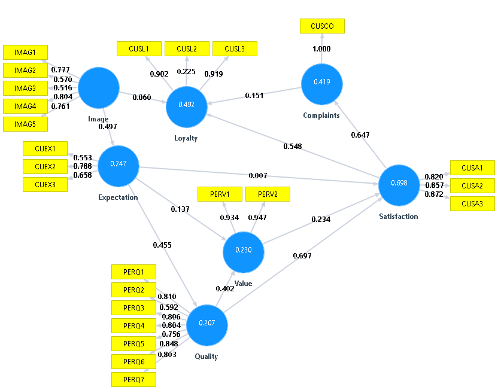

## Model from semPLS Paper

Complex model from semPLS paper:



## Scatterplot Predicted vs Actuals Complaints (CUSCO)

```{r, echo=FALSE}
#Clean Environment
rm(list=ls())

#Load semPLS package for Data
library("semPLS")

#Load our Algorithm
source("../lib/simplePLS.R")
source("../lib/graphUtils.R")

#Load data
data("mobi")

#Prepare the random sampling
set.seed(123)
index=sample.int(dim(mobi)[1],250,replace=F)
trainData=mobi[index[1:200],]
holdData=mobi[index[201:250],]

#Load Structural and Measurement Models
data("ECSIsm")
data("ECSImm")

#Transform models to simplePLS
smMatrix<-ECSIsm
mmMatrix<-cbind(ECSImm,rep("R",nrow(ECSImm)))
colnames(mmMatrix)<-c("latent","measurement","type")

#Call PLS-PM Function
plsModel<-simplePLS(trainData,smMatrix,mmMatrix)

#Call Prediction Function
predHold <- PLSpredict(plsModel,holdData)


#Get results from model
smMatrix <- plsModel$smMatrix
mmMatrix <- plsModel$mmMatrix
ltVariables <- plsModel$ltVariables
mmVariables <- plsModel$mmVariables
outer_weights <- plsModel$outer_weights
outer_loadings <- plsModel$outer_loadings
meanData<-plsModel$meanData
sdData <- plsModel$sdData
path_coef<-plsModel$path_coef

pMeasurements<-c("CUEX1","CUEX2","CUEX3","PERV1","PERV2","PERQ1","PERQ2","PERQ3","PERQ4","PERQ5","PERQ6","PERQ7")

#Extract Measurements needed for Predictions
normData <- holdData[,pMeasurements]

#Normalize data
for (i in pMeasurements)
{
  normData[,i] <-(holdData[,i] - meanData[i])/sdData[i]
}  

#Convert dataset to matrix
normData<-data.matrix(normData)

#Estimate Factor Scores from Outter Path
fscores <- normData%*%outer_weights[pMeasurements,c("Expectation","Value","Quality")]

fsSatisfaction<-fscores%*%path_coef[c("Expectation","Value","Quality"),c("Satisfaction")]

fsComplaints<-fsSatisfaction%*%path_coef[c("Satisfaction"),c("Complaints")]

#Denormalize
fsComplaints2<-(fsComplaints * sdData["CUSCO"])+meanData["CUSCO"]

#Get Residuals
res2Complaints <- holdData[,c("CUSCO")] - fsComplaints2

#Set the panels
par(mfrow=c(2,2))

#Find scales
xmax<-ceiling(max(c(holdData[,"CUSCO"])))

ymax<-10


pMeasurements<-c("CUSA1","CUSA2","CUSA3")

#Extract Measurements needed for Predictions
normData <- holdData[,pMeasurements]

#Normalize data
for (i in pMeasurements)
{
  normData[,i] <-(holdData[,i] - meanData[i])/sdData[i]
}  

#Convert dataset to matrix
normData<-data.matrix(normData)

#Estimate Factor Scores from Outter Path
fsSatisfaction <- normData%*%outer_weights[c("CUSA1","CUSA2","CUSA3"),c("Satisfaction")]

fsComplaints<-fsSatisfaction%*%path_coef[c("Satisfaction"),c("Complaints")]

#Denormalize
fsComplaints1<-(fsComplaints * sdData["CUSCO"])+meanData["CUSCO"]

#Get Residuals
res1Complaints <- holdData[,c("CUSCO")] - fsComplaints1

#Calculating the Average
avgComplaints<-fsComplaints

for (i in 1:nrow(fsComplaints))
  avgComplaints[i,]<-mean(c(fsComplaints1[i,],fsComplaints2[i,]))

#Get Residuals
resAvgComplaints <- holdData[,c("CUSCO")] - avgComplaints

#PLS: Actual vs Predicted (CUSL1)
y<-predHold$predictedMeasurements[,"CUSCO"]
x<-holdData[,"CUSCO"]
title="CUSCO Predicted from (Image)"
xlabel=paste("Mean: Act=",
             signif(mean(x),digits=4),
             "PLS=",
             signif(mean(y),digits=4),
             "\n SD: Act=",
             signif(sd(x),digits=4),
             "PLS=",
             signif(sd(y),digits=4))
ylabel="Predicted"
graphScatterplot42(x,y,title,xlabel,ylabel,xmax=xmax,ymax=ymax)


#PLS: Actual vs Predicted (CUSL1)
y<-fsComplaints2
x<-holdData[,"CUSCO"]
title="CUSCO Predicted from (Expectation, Value, Quality)"
xlabel=paste("Mean: Act=",
             signif(mean(x),digits=4),
             "PLS=",
             signif(mean(y),digits=4),
             "\n SD: Act=",
             signif(sd(x),digits=4),
             "PLS=",
             signif(sd(y),digits=4))
ylabel="Predicted"
graphScatterplot42(x,y,title,xlabel,ylabel,xmax=xmax,ymax=ymax)


#PLS: Actual vs Predicted (CUSL1)
y<-fsComplaints1
x<-holdData[,"CUSCO"]
title="CUSCO Predicted from (Satisfaction)"
xlabel=paste("Mean: Act=",
             signif(mean(x),digits=4),
             "PLS=",
             signif(mean(y),digits=4),
             "\n SD: Act=",
             signif(sd(x),digits=4),
             "PLS=",
             signif(sd(y),digits=4))
ylabel="Predicted"
graphScatterplot42(x,y,title,xlabel,ylabel,xmax=xmax,ymax=ymax)

#PLS: Actual vs Predicted (CUSL1)
y<-avgComplaints
x<-holdData[,"CUSCO"]
title="CUSCO Average Prediction"
xlabel=paste("Mean: Act=",
             signif(mean(x),digits=4),
             "PLS=",
             signif(mean(y),digits=4),
             "\n SD: Act=",
             signif(sd(x),digits=4),
             "PLS=",
             signif(sd(y),digits=4))
ylabel="Predicted"
graphScatterplot42(x,y,title,xlabel,ylabel,xmax=xmax,ymax=ymax)

```

## Residuals Histogram for Predictions

```{r, echo=FALSE}
#Set the panels
par(mfrow=c(2,2))

title<-"Residuals from IMAGE predicting "

newgraphResiduals("CUSCO",predHold$residuals,title,c(-8,6),c(0,0.4))
  
title<-"Res from Expectation, Value, Quality predicting "

colnames(res2Complaints) <- "CUSCO"

newgraphResiduals("CUSCO",res2Complaints,title,c(-8,6),c(0,0.4))

title<-"Residuals from Satisfaction predicting "

colnames(res1Complaints) <- "CUSCO"

newgraphResiduals("CUSCO",res1Complaints,title,c(-8,6),c(0,0.4))

title<-"Residuals from Average predicting "

colnames(resAvgComplaints) <- "CUSCO"

newgraphResiduals("CUSCO",resAvgComplaints,title,c(-8,6),c(0,0.4))


```
