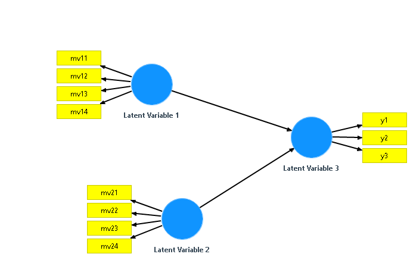
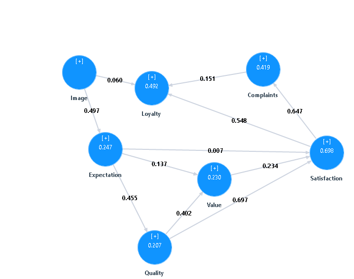

## Outline

This week we performed several tests with simulated Data, and compared the prediction between PLS-PM algorithm vs NN these are the different simulations utilized:

- Data from Suneel with simsem package.
- Data from Vinz Esposito's Paper (plspm package).
- Data from Juan Simulation using multivariate normal distributions.

We also constructed the complex model from the semPLS Package Paper.

##Suneel's simsem Model 


```{r, echo=FALSE}
#Clear the Environment
rm(list=ls())

#Load our Algorithm
source("../lib/simplePLS.R")
source("../lib/graphUtils.R")

#Load Data
trainData=read.csv("../data/simTrain.csv",header=T)
holdData=read.csv("../data/simHoldout.csv",header=T)
nnPredData=read.csv("../data/simPred.csv",header=T)

#Calculate nn prediction residuals
nnPredResiduals<-holdData[,c("y1","y2","y3","y4")]-nnPredData[,c("y1","y2","y3","y4")]

#Create the Matrix of the Structural Model
smMatrix <- matrix(c("Latent Variable 1", "Latent Variable 3",
                     "Latent Variable 2","Latent Variable 3"),nrow=2,ncol=2,byrow =TRUE,
                   dimnames = list(1:2,c("source","target")))

#Create the Matrix of the Measurement Model
mmMatrix <- matrix(c("Latent Variable 1","x11","R",
                     "Latent Variable 1","x12","R",
                     "Latent Variable 1","x13","R",
                     "Latent Variable 1","x14","R",
                     "Latent Variable 2","x21","R",
                     "Latent Variable 2","x22","R",
                     "Latent Variable 2","x23","R",
                     "Latent Variable 2","x24","R",
                     "Latent Variable 3","y1","R",
                     "Latent Variable 3","y2","R",
                     "Latent Variable 3","y3","R",
                     "Latent Variable 3","y4","R"),nrow=12,ncol=3,byrow =TRUE,
                   dimnames = list(1:12,c("latent","measurement","type")))

#Call PLS-PM Function
plsModel<-simplePLS(trainData,smMatrix,mmMatrix)

#Call Prediction Function
predHold <- PLSpredict(plsModel,holdData)
```

## Scatterplot Actual vs Predictions (PLS and NN)

```{r, echo=FALSE}
#Set the panels
par(mfrow=c(2,2))

#Find scales
xmax<-ceiling(max(c(holdData[,"y1"],
                    holdData[,"y2"],
                    holdData[,"y3"],
                    holdData[,"y4"])))

ymax<-ceiling(max(c(predHold$predictedMeasurements[,"y1"],
                    predHold$predictedMeasurements[,"y2"],
                    predHold$predictedMeasurements[,"y3"],
                    predHold$predictedMeasurements[,"y4"])))

#PLS: Actual vs Predicted (y1)
y<-predHold$predictedMeasurements[,"y1"]
x<-holdData[,"y1"]
z<-nnPredData[,"y1"]
title="Actual vs Predicted (y1)"
xlabel=paste("Mean: Act=",
             signif(mean(x),digits=4),
             "PLS=",
             signif(mean(y),digits=4),
             "NN=",
             signif(mean(z),digits=4),
             "\n SD: Act=",
             signif(sd(x),digits=4),
             "PLS=",
             signif(sd(y),digits=4),
             "NN=",
             signif(sd(z),digits=4))
ylabel="Predicted"
graphScatterplot(x,y,z,title,xlabel,ylabel,xmax=xmax,ymax=ymax)
points(x,z, col= "black")

#PLS: Actual vs Predicted (y2)
y<-predHold$predictedMeasurements[,"y2"]
x<-holdData[,"y2"]
z<-nnPredData[,"y2"]
title="Actual vs Predicted (y2)"
xlabel=paste("Mean: Act=",
             signif(mean(x),digits=4),
             "PLS=",
             signif(mean(y),digits=4),
             "NN=",
             signif(mean(z),digits=4),
             "\n SD: Act=",
             signif(sd(x),digits=4),
             "PLS=",
             signif(sd(y),digits=4),
             "NN=",
             signif(sd(z),digits=4))
ylabel="Predicted"
graphScatterplot(x,y,z,title,xlabel,ylabel,xmax=xmax,ymax=ymax)
points(x,z, col= "black")

#PLS: Actual vs Predicted (y3)
y<-predHold$predictedMeasurements[,"y3"]
x<-holdData[,"y3"]
z<-nnPredData[,"y3"]
title="Actual vs Predicted (y3)"
xlabel=paste("Mean: Act=",
             signif(mean(x),digits=4),
             "PLS=",
             signif(mean(y),digits=4),
             "NN=",
             signif(mean(z),digits=4),
             "\n SD: Act=",
             signif(sd(x),digits=4),
             "PLS=",
             signif(sd(y),digits=4),
             "NN=",
             signif(sd(z),digits=4))
ylabel="Predicted"
graphScatterplot(x,y,z,title,xlabel,ylabel,xmax=xmax,ymax=ymax)
points(x,z, col= "black")

#PLS: Actual vs Predicted (y3)
y<-predHold$predictedMeasurements[,"y4"]
x<-holdData[,"y4"]
z<-nnPredData[,"y4"]
title="Actual vs Predicted (y4)"
xlabel=paste("Mean: Act=",
             signif(mean(x),digits=4),
             "PLS=",
             signif(mean(y),digits=4),
             "NN=",
             signif(mean(z),digits=4),
             "\n SD: Act=",
             signif(sd(x),digits=4),
             "PLS=",
             signif(sd(y),digits=4),
             "NN=",
             signif(sd(z),digits=4))
ylabel="Predicted"
graphScatterplot(x,y,z,title,xlabel,ylabel,xmax=xmax,ymax=ymax)
points(x,z, col= "black")
```

## Residuals Histogram PLS vs NN

```{r, echo=FALSE}
#Set the panels
par(mfrow=c(2,2))

title<-"PLS vs NN Residuals"

graphCombinedResiduals("y1",nnPredResiduals,predHold$residuals,title,c(-4,4),c(0,0.8),10,"NN","PLS")

graphCombinedResiduals("y2",nnPredResiduals,predHold$residuals,title,c(-4,4),c(0,0.8),10,"NN","PLS")

graphCombinedResiduals("y3",nnPredResiduals,predHold$residuals,title,c(-4,4),c(0,0.8),10,"NN","PLS")

graphCombinedResiduals("y4",nnPredResiduals,predHold$residuals,title,c(-4,4),c(0,0.8),10,"NN","PLS")
```

## Model from Vinz Esposito's Paper (plspm package) 

Gaston Sanchez's Package plspm provides the data and model proposed by Vinz Esposito and Laura Trinchera:


```{r, echo=FALSE}
#Load our Algorithm
source("../lib/simplePLS.R")
source("../lib/graphUtils.R")

#Load library for simulated Data
library("plspm")

#Load Data
data(simdata)

#Prepare the random sampling
set.seed(123)
index=sample.int(dim(simdata)[1],400,replace=F)
trainData=simdata[index[1:300],]
holdData=simdata[index[301:400],]

#Create the Matrix of the Structural Model
smMatrix <- matrix(c("Price", "Satisfaction",
                     "Quality","Satisfaction"),nrow=2,ncol=2,byrow =TRUE,
                   dimnames = list(1:2,c("source","target")))

#Create the Matrix of the Measurement Model
mmMatrix <- matrix(c("Price","mv1","R",
                     "Price","mv2","R",
                     "Price","mv3","R",
                     "Price","mv4","R",
                     "Price","mv5","R",
                     "Quality","mv6","R",
                     "Quality","mv7","R",
                     "Quality","mv8","R",
                     "Quality","mv9","R",
                     "Quality","mv10","R",
                     "Satisfaction","mv11","R",
                     "Satisfaction","mv12","R",
                     "Satisfaction","mv13","R"),nrow=13,ncol=3,byrow =TRUE,
                   dimnames = list(1:13,c("latent","measurement","type")))

#Call PLS-PM Function
plsModel<-simplePLS(trainData,smMatrix,mmMatrix)

#Call Prediction Function
predHold <- PLSpredict(plsModel,holdData)
  

## fitting neural net model
require(nnet)

X=trainData[,c(1:10)]
Y=trainData[,c(11:13)]

# Model with two hidden nodes
net1=nnet(X,Y,size=2,linout =T)
nnPredData=data.frame(predict(net1,holdData))

#Calculate nn prediction residuals
nnPredResiduals<-holdData[,c("mv11","mv12","mv13")]-nnPredData[,c("mv11","mv12","mv13")]

```
## Scatterplot Actual vs Predictions (PLS and NN)
```{r, echo=FALSE}
#Set the panels
par(mfrow=c(2,2))

#Find scales
xmax<-ceiling(max(c(holdData[,"mv11"],
                    holdData[,"mv12"],
                    holdData[,"mv13"])))

ymax<-ceiling(max(c(predHold$predictedMeasurements[,"mv11"],
                    predHold$predictedMeasurements[,"mv12"],
                    predHold$predictedMeasurements[,"mv13"])))

#PLS: Actual vs Predicted (mv11)
y<-predHold$predictedMeasurements[,"mv11"]
x<-holdData[,"mv11"]
z<-nnPredData[,"mv11"]
title="Actual vs Predicted (mv11)"
xlabel=paste("Mean: Act=",
             signif(mean(x),digits=4),
             "PLS=",
             signif(mean(y),digits=4),
             "NN=",
             signif(mean(z),digits=4),
             "\n SD: Act=",
             signif(sd(x),digits=4),
             "PLS=",
             signif(sd(y),digits=4),
             "NN=",
             signif(sd(z),digits=4))
ylabel="Predicted"
graphScatterplot(x,y,z,title,xlabel,ylabel,xmax=xmax,ymax=ymax)
points(x,z, col= "black")

#PLS: Actual vs Predicted (mv12)
y<-predHold$predictedMeasurements[,"mv12"]
x<-holdData[,"mv12"]
z<-nnPredData[,"mv12"]
title="Actual vs Predicted (mv12)"
xlabel=paste("Mean: Act=",
             signif(mean(x),digits=4),
             "PLS=",
             signif(mean(y),digits=4),
             "NN=",
             signif(mean(z),digits=4),
             "\n SD: Act=",
             signif(sd(x),digits=4),
             "PLS=",
             signif(sd(y),digits=4),
             "NN=",
             signif(sd(z),digits=4))
ylabel="Predicted"
graphScatterplot(x,y,z,title,xlabel,ylabel,xmax=xmax,ymax=ymax)
points(x,z, col= "black")

#PLS: Actual vs Predicted (mv13)
y<-predHold$predictedMeasurements[,"mv13"]
x<-holdData[,"mv13"]
z<-nnPredData[,"mv13"]
title="Actual vs Predicted (mv13)"
xlabel=paste("Mean: Act=",
             signif(mean(x),digits=4),
             "PLS=",
             signif(mean(y),digits=4),
             "NN=",
             signif(mean(z),digits=4),
             "\n SD: Act=",
             signif(sd(x),digits=4),
             "PLS=",
             signif(sd(y),digits=4),
             "NN=",
             signif(sd(z),digits=4))
ylabel="Predicted"
graphScatterplot(x,y,z,title,xlabel,ylabel,xmax=xmax,ymax=ymax)
points(x,z, col= "black")

```

## Residuals Histogram PLS vs NN

```{r, echo=FALSE}
#Set the panels
par(mfrow=c(2,2))

title<-"PLS vs NN Residuals"

graphCombinedResiduals("mv11",nnPredResiduals,predHold$residuals,title,c(-6,6),c(0,0.5),10,"NN","PLS")

graphCombinedResiduals("mv12",nnPredResiduals,predHold$residuals,title,c(-6,6),c(0,0.5),10,"NN","PLS")

graphCombinedResiduals("mv13",nnPredResiduals,predHold$residuals,title,c(-6,6),c(0,0.5),10,"NN","PLS")
```

## Model from Juan's Simulation 

Juan generated simulated data using multivariate normal distribution:


```{r, echo=FALSE}
#Clear the Environment
rm(list=ls())
#Prepare the random sampling
set.seed(123)
require(mnormt)
#Four Variables Mean 2 SD =2
Sigma <- matrix(c(4,2,2,2,2,4,2,2,2,2,4,2,2,2,2,4),4,4)
mu <- c(2, 2, 2, 2)
x1<-rmnorm(300,mu,Sigma)
w1<-c(0.4,0.9,0.8,0.6)
fc1<-x1%*%w1

#Four Variables Mean 0, SD =1
Sigma <- matrix(c(1,0.5,0.5,0.5,0.5,1,0.5,0.5,0.5,0.5,1,0.5,0.5,0.5,0.5,1),4,4)
mu <- c(0, 0, 0, 0)
x2<-rmnorm(300,mu,Sigma)
w2<-c(0.3,0.7,0.65,0.72)
fc2<-x2%*%w2

#get the third factor score
fc3<-0.85*fc1+0.34*fc2

y1<-fc3*0.6
y2<-fc3*0.37
y3<-fc3*0.82
y4<-fc3*0.32

data<-cbind(x1,x2,y1,y2,y3,y4)
colnames(data)<-c("x11","x12","x13","x14","x21","x22","x23","x24","y1","y2","y3","y4")

source("../lib/simplePLS.R")
source("../lib/graphUtils.R")

#Prepare the random sampling
set.seed(123)
index=sample.int(dim(data)[1],300,replace=F)
trainData=data[index[1:200],]
holdData=data[index[201:300],]

#Create the Matrix of the Structural Model
smMatrix <- matrix(c("Latent Variable 1", "Latent Variable 3",
                     "Latent Variable 2","Latent Variable 3"),nrow=2,ncol=2,byrow =TRUE,
                   dimnames = list(1:2,c("source","target")))

#Create the Matrix of the Measurement Model
mmMatrix <- matrix(c("Latent Variable 1","x11","R",
                     "Latent Variable 1","x12","R",
                     "Latent Variable 1","x13","R",
                     "Latent Variable 1","x14","R",
                     "Latent Variable 2","x21","R",
                     "Latent Variable 2","x22","R",
                     "Latent Variable 2","x23","R",
                     "Latent Variable 2","x24","R",
                     "Latent Variable 3","y1","R",
                     "Latent Variable 3","y2","R",
                     "Latent Variable 3","y3","R",
                     "Latent Variable 3","y4","R"),nrow=12,ncol=3,byrow =TRUE,
                   dimnames = list(1:12,c("latent","measurement","type")))

#Call PLS-PM Function
plsModel<-simplePLS(trainData,smMatrix,mmMatrix)

#Call Prediction Function
predHold <- PLSpredict(plsModel,holdData)


## fitting neural net model
require(nnet)

X=trainData[,c(1:8)]
Y=trainData[,c(9:12)]

# Model with two hidden nodes
net1=nnet(X,Y,size=2,linout =T)
nnPredData=data.frame(predict(net1,holdData))

#Calculate NN Residuals
nnPredResiduals<-holdData[,c("y1","y2","y3","y4")]-nnPredData[,c("y1","y2","y3","y4")]

```
## Scatterplot Actual VS Predicted

```{r, echo=FALSE}
#Set the panels
par(mfrow=c(2,2))

#Find scales
xmax<-ceiling(max(c(holdData[,"y1"],
                    holdData[,"y2"],
                    holdData[,"y3"],
                    holdData[,"y4"])))

ymax<-ceiling(max(c(predHold$predictedMeasurements[,"y1"],
                    predHold$predictedMeasurements[,"y2"],
                    predHold$predictedMeasurements[,"y3"],
                    predHold$predictedMeasurements[,"y4"],
                    nnPredData[,"y1"],
                    nnPredData[,"y2"],
                    nnPredData[,"y3"],
                    nnPredData[,"y4"])))

xmin<-floor(min(c(holdData[,"y1"],
                    holdData[,"y2"],
                    holdData[,"y3"],
                    holdData[,"y4"])))

ymin<-floor(min(c(predHold$predictedMeasurements[,"y1"],
                    predHold$predictedMeasurements[,"y2"],
                    predHold$predictedMeasurements[,"y3"],
                    predHold$predictedMeasurements[,"y4"],
                  nnPredData[,"y1"],
                  nnPredData[,"y2"],
                  nnPredData[,"y3"],
                  nnPredData[,"y4"])))

#PLS: Actual vs Predicted (y1)
y<-predHold$predictedMeasurements[,"y1"]
x<-holdData[,"y1"]
z<-nnPredData[,"y1"]
title="Actual vs Predicted (y1)"
xlabel=paste("Mean: Act=",
             signif(mean(x),digits=4),
             "PLS=",
             signif(mean(y),digits=4),
             "NN=",
             signif(mean(z),digits=4),
             "\n SD: Act=",
             signif(sd(x),digits=4),
             "PLS=",
             signif(sd(y),digits=4),
             "NN=",
             signif(sd(z),digits=4))
ylabel="Predicted"
graphScatterplot(x,y,z,title,xlabel,ylabel,xmax=xmax,ymax=ymax,xmin=xmin,ymin=ymin)
points(x,z, col= "black")


#PLS: Actual vs Predicted (y2)
y<-predHold$predictedMeasurements[,"y2"]
x<-holdData[,"y2"]
z<-nnPredData[,"y2"]
title="Actual vs Predicted (y2)"
xlabel=paste("Mean: Act=",
             signif(mean(x),digits=4),
             "PLS=",
             signif(mean(y),digits=4),
             "NN=",
             signif(mean(z),digits=4),
             "\n SD: Act=",
             signif(sd(x),digits=4),
             "PLS=",
             signif(sd(y),digits=4),
             "NN=",
             signif(sd(z),digits=4))
ylabel="Predicted"
graphScatterplot(x,y,z,title,xlabel,ylabel,xmax=xmax,ymax=ymax,xmin=xmin,ymin=ymin)
points(x,z, col= "black")

#PLS: Actual vs Predicted (y3)
y<-predHold$predictedMeasurements[,"y3"]
x<-holdData[,"y3"]
z<-nnPredData[,"y3"]
title="Actual vs Predicted (y3)"
xlabel=paste("Mean: Act=",
             signif(mean(x),digits=4),
             "PLS=",
             signif(mean(y),digits=4),
             "NN=",
             signif(mean(z),digits=4),
             "\n SD: Act=",
             signif(sd(x),digits=4),
             "PLS=",
             signif(sd(y),digits=4),
             "NN=",
             signif(sd(z),digits=4))
ylabel="Predicted"
graphScatterplot(x,y,z,title,xlabel,ylabel,xmax=xmax,ymax=ymax,xmin=xmin,ymin=ymin)
points(x,z, col= "black")

#PLS: Actual vs Predicted (y3)
y<-predHold$predictedMeasurements[,"y4"]
x<-holdData[,"y4"]
z<-nnPredData[,"y4"]
title="Actual vs Predicted (y4)"
xlabel=paste("Mean: Act=",
             signif(mean(x),digits=4),
             "PLS=",
             signif(mean(y),digits=4),
             "NN=",
             signif(mean(z),digits=4),
             "\n SD: Act=",
             signif(sd(x),digits=4),
             "PLS=",
             signif(sd(y),digits=4),
             "NN=",
             signif(sd(z),digits=4))
ylabel="Predicted"
graphScatterplot(x,y,z,title,xlabel,ylabel,xmax=xmax,ymax=ymax,xmin=xmin,ymin=ymin)
points(x,z, col= "black")
```

## Residuals Histogram PLS vs NN

```{r, echo=FALSE}
#Set the panels
par(mfrow=c(2,2))

title<-"PLS vs NN Residuals"

graphCombinedResiduals("y1",nnPredResiduals,predHold$residuals,title,c(-1,1),c(0,20),10,"NN","PLS")

graphCombinedResiduals("y2",nnPredResiduals,predHold$residuals,title,c(-1,1),c(0,20),10,"NN","PLS")

graphCombinedResiduals("y3",nnPredResiduals,predHold$residuals,title,c(-1,1),c(0,20),10,"NN","PLS")

graphCombinedResiduals("y4",nnPredResiduals,predHold$residuals,title,c(-1,1),c(0,20),10,"NN","PLS")
```

## Model from semPLS Paper

This is the contracted model (only latent variables) utilized by the semPLS paper:



## Model from semPLS Paper

This is the detailed model utilized by semPLS paper:


